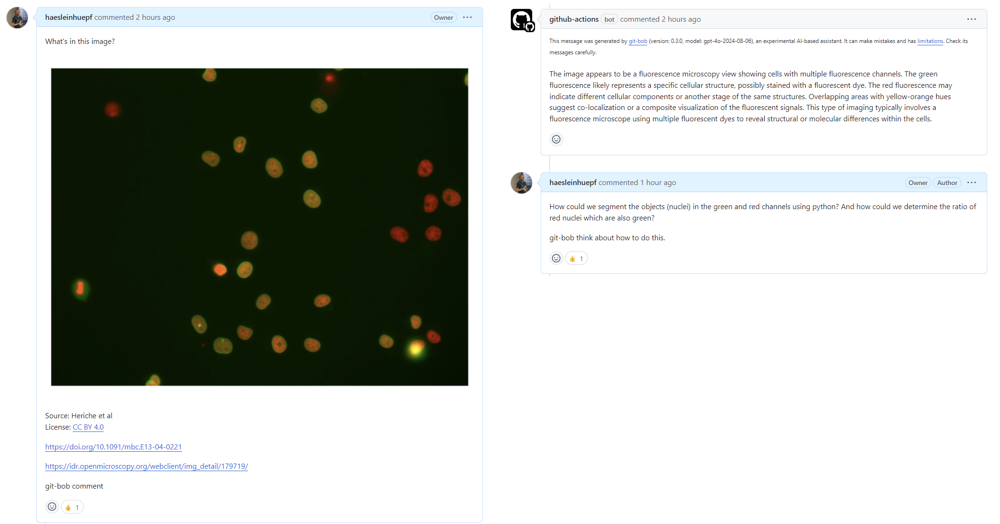
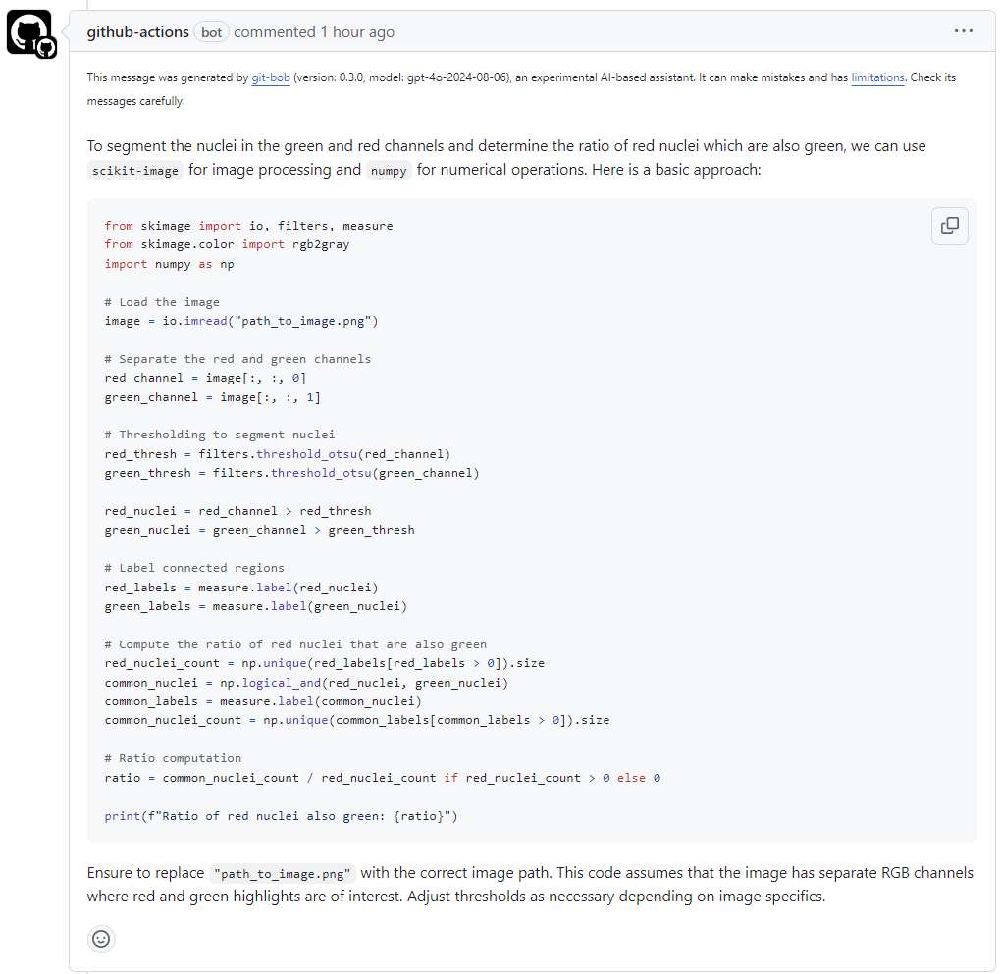
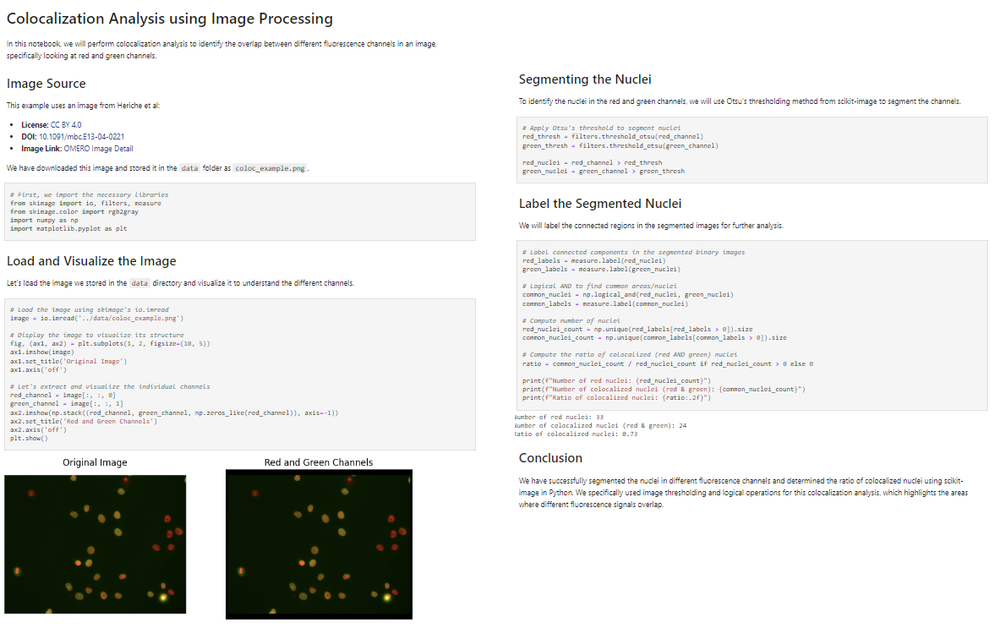

# git-bob: AI-assisted bio-image analysis

In this repository, you have the opportunity to [upload an image and an analysis request](https://github.com/haesleinhuepf/git-bob-bioimage-analysis-example/issues/new?assignees=haesleinhuepf&labels=image-analysis&projects=&template=bioimage_analysis.md&title=%5BAnalysis+Request%5D%3A+) 
which will then be answered by [git-bob](https://github.com/haesleinhuepf/git-bob) an AI-assistant. 
To make sure that the system does not get overwhelmed with requests, [@haesleinhuepf](https://github.com/haesleinhuepf) has to review requests and 
can also help guiding the AI-assistant so that useful results come out.

This is a research project that serves exploring how we humans need to interact with AI-assistants to get reliable and trustworthy results. 
It may be changed or shut down at any time.

**Note:** Your images and the text you enter here may be sent to [OpenAI](https://openai.com/)'s online service where we use a large language model to answer your request. 
Do not upload any data you cannot share openly. Also, do not enter any private or secret information. By submitting this GitHub issue, you confirm that you understand these conditions.

[Submit your image and your request here](https://github.com/haesleinhuepf/git-bob-bioimage-analysis-example/issues/new?assignees=haesleinhuepf&labels=image-analysis&projects=&template=bioimage_analysis.md&title=%5BAnalysis+Request%5D%3A+)

## Example

As an example, you can look at [this GitHub issue](): I uploaded an image 

And after a short discussion, git-bob provided me with the following bio-image analysis code:

I then asked it to provide the code as a notebook in a [pull-request](https://github.com/haesleinhuepf/git-bob-bioimage-analysis-example/pull/9). 
There, we could download the [notebook](https://github.com/haesleinhuepf/git-bob-bioimage-analysis-example/blob/664793743d5f4c5b101f3a66139c0a54ca485038/notebooks/coloc_analysis.ipynb):

It is certainly not perfect, but [git-bob](https://github.com/haesleinhuepf/git-bob) allows us to explore possibilities. 
Plus: Our conversations with the AI-assistant are conserved and others can learn from them how to prompt for bio-image analysis code!

## Feedback welcome

If you tried git-bob on your own, you also directly provide feedback to the AI-assistant by [opening an issue on its repository](https://github.com/haesleinhuepf/git-bob).
